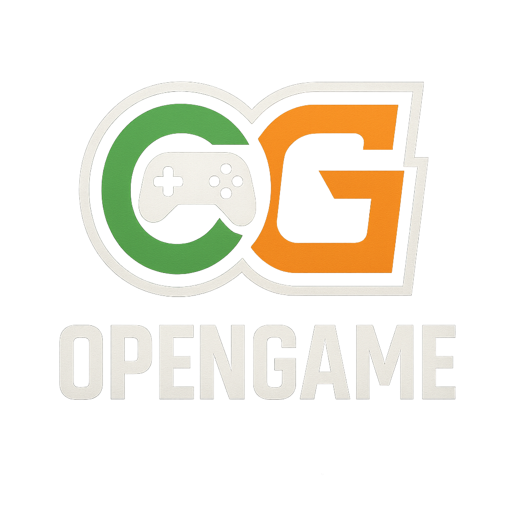

<p align="center">
  
  <h1 align="center"></h1>
</p>


# OpenGame 🎮
this is a opensource gaming software that tries to just be good,provide users with tools and good ui with the minimum system overhead.

## Optimizations

software ui has made using electron but all the underlinig tools are written in c,c++,python to be good as possible we can make them.
## Features

- Light/dark mode toggle
- Live previews
- Fullscreen mode
- Cross platform


## Screenshots


## Installation

Install my-project with npm

```bash
  npm install my-project
  cd my-project
```
    
## Usage/Examples

just run the program using the shortcuts on the desktop/startmenu or:
```powershell
cd OpenGame
.\opengame.exe
```
or if you used the installer(it will be automaticly added to your system path)
```powershell
opengame
```
## Support

For support, email fake@fake.com or join our Slack channel.


## API Reference
the software has a http and a websocket api engine for automation outside of the program itself


#### Get all items

```http
  GET /api/items
```

| Parameter | Type     | Description                |
| :-------- | :------- | :------------------------- |
| `api_key` | `string` | **Required**. Your API key |

#### Get item

```http
  GET /api/items/${id}
```

| Parameter | Type     | Description                       |
| :-------- | :------- | :-------------------------------- |
| `id`      | `string` | **Required**. Id of item to fetch |


## Contributing

Contributions are always welcome!

See `contributing.md` for ways to get started.

Please adhere to this project's `code of conduct`.


## Authors

- [@octokatherine](https://www.github.com/octokatherine)
